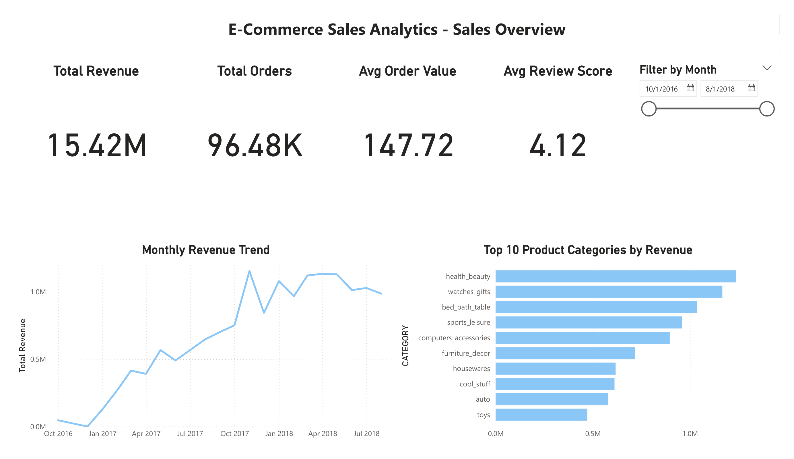
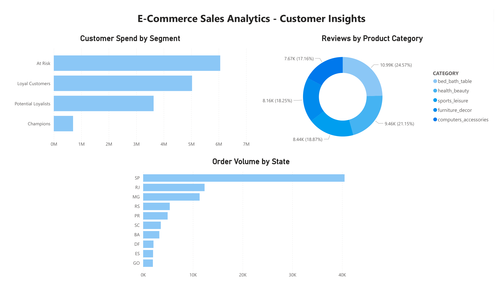

# E-Commerce Sales Analytics Pipeline
### Snowflake • dbt • Python • Power BI • NLP • ML

An end-to-end ELT data pipeline analyzing 100K+ e-commerce orders from the Brazilian Olist dataset. Built to demonstrate modern data engineering and analytics skills across the full stack — from raw data ingestion to a live Power BI dashboard.

---

## Architecture
```
Kaggle CSVs → Python → Snowflake (RAW) → dbt → Snowflake (MARTS) → Power BI
                                                      ↓
                                               Python ML/NLP
                                         (VADER • K-Means • Prophet)
```

---

## Tech Stack

| Layer | Tool |
|---|---|
| Cloud Warehouse | Snowflake |
| Transformation | dbt Core |
| Data Loading | Python, snowflake-connector-python |
| NLP | VADER Sentiment Analysis |
| ML | Scikit-learn K-Means Clustering |
| Forecasting | Prophet |
| Dashboard | Power BI (DirectQuery → Snowflake) |
| Version Control | Git, GitHub |

---

## Dataset

**Brazilian E-Commerce Public Dataset by Olist** — available on Kaggle

| Table | Rows | Description |
|---|---|---|
| RAW_ORDERS | 99,441 | Order status and timestamps |
| RAW_ORDER_ITEMS | 112,650 | Products, prices, freight per order |
| RAW_ORDER_PAYMENTS | 103,886 | Payment type and value |
| RAW_ORDER_REVIEWS | 99,224 | Review scores and text |
| RAW_CUSTOMERS | 99,441 | Customer location |
| RAW_SELLERS | 3,095 | Seller location |
| RAW_PRODUCTS | 32,951 | Product category and dimensions |
| RAW_CATEGORY_TRANSLATION | 71 | Portuguese to English categories |
| RAW_GEOLOCATION | 1,000,163 | Zip code level coordinates |

---

## Project Structure
```
ecommerce-pipeline/
├── data/
│   └── raw/                          # Olist CSVs (not tracked in git)
├── ecommerce_analytics/              # dbt project
│   ├── models/
│   │   ├── staging/                  # 9 staging models (views)
│   │   │   ├── stg_orders.sql
│   │   │   ├── stg_order_items.sql
│   │   │   ├── stg_order_payments.sql
│   │   │   ├── stg_order_reviews.sql
│   │   │   ├── stg_customers.sql
│   │   │   ├── stg_sellers.sql
│   │   │   ├── stg_products.sql
│   │   │   ├── stg_category_translation.sql
│   │   │   └── stg_geolocation.sql
│   │   └── marts/                    # 5 mart models (tables)
│   │       ├── mart_monthly_revenue.sql
│   │       ├── mart_customer_ltv.sql
│   │       ├── mart_product_performance.sql
│   │       ├── mart_seller_performance.sql
│   │       └── mart_delivery_analysis.sql
│   ├── macros/
│   │   └── generate_schema_name.sql
│   └── dbt_project.yml
├── scripts/
│   ├── setup_snowflake.sql           # Snowflake setup script
│   ├── load_to_snowflake.py          # Data loading script
│   ├── sentiment_analysis.py         # VADER NLP sentiment
│   ├── customer_segmentation.py      # K-Means clustering
│   └── sales_forecasting.py          # Prophet forecasting
├── visuals/
│   ├── elbow_curve.png
│   ├── customer_segments.png
│   └── revenue_forecast.png
├── ecommerce_dashboard.pbix          # Power BI dashboard
└── README.md
```

---

## dbt Models

### Staging (9 models — materialized as views)
One staging model per raw table. Each model cleans column names, casts data types, handles nulls, and filters invalid records.

### Marts (5 models — materialized as tables)

| Model | Description | Key SQL Features |
|---|---|---|
| mart_monthly_revenue | Monthly revenue trends | LAG, cumulative SUM, rolling AVG window functions |
| mart_customer_ltv | Customer lifetime value + RFM scoring | NTILE, CTEs, customer segmentation |
| mart_product_performance | Product and category rankings | RANK, PARTITION BY category |
| mart_seller_performance | Seller KPIs and delivery metrics | Conditional aggregation, RANK |
| mart_delivery_analysis | Delivery performance by state | CASE, on-time % calculation |

---

## ML & NLP Analysis

### 1. Sentiment Analysis (VADER NLP)
- Analyzed 99,224 customer reviews using VADER sentiment scoring
- **58.7%** of customers left no review text
- Customers who write are more likely to be complaining — negative reviews average 3.25 stars vs 4.38 for no-text reviews

### 2. Customer Segmentation (K-Means)
- Clustered 96,477 customers using RFM features (Recency, Frequency, Monetary)
- Identified 4 segments: Champions, Loyal Customers, Potential Loyalists, At Risk
- Key finding: Nearly all customers ordered only once — significant repeat purchase problem

### 3. Sales Forecasting (Prophet)
- Trained on 22 months of revenue data (Oct 2016 → Aug 2018)
- Average monthly revenue: $701K, peak: $1.15M
- Forecasted 3-month revenue trend with confidence intervals

---

## Power BI Dashboard

Connected live to Snowflake MARTS schema via DirectQuery.

### Page 1 — Sales Overview


- 4 KPI cards: Total Revenue ($15.42M), Total Orders (96.48K), Avg Order Value ($147.72), Avg Review Score (4.12)
- Monthly Revenue Trend line chart
- Top 10 Product Categories by Revenue
- Filter by Month slicer

### Page 2 — Customer Insights


- Customer Spend by Segment bar chart
- Reviews by Product Category donut chart
- Order Volume by State bar chart

---

## Key Business Findings

1. **Health & Beauty is the #1 revenue category** — consistently outperforms all other categories
2. **São Paulo (SP) drives 40%+ of all orders** — heavy geographic concentration in one state
3. **58.7% of customers never write reviews** — those who do are 3x more likely to be complaining
4. **Almost all customers ordered only once** — Olist has a serious repeat purchase problem across all segments
5. **Revenue grew 10x** from Oct 2016 to mid-2018, showing strong business momentum

---

## How to Reproduce

### 1. Snowflake Setup
Run `scripts/setup_snowflake.sql` in a Snowflake worksheet

### 2. Environment Setup
```bash
py -3.11 -m venv .venv
.venv\Scripts\activate
pip install pandas snowflake-connector-python[pandas] dbt-snowflake vaderSentiment prophet scikit-learn matplotlib seaborn python-dotenv
```

### 3. Configure credentials
Create a `.env` file in the project root:
```
SNOWFLAKE_USER=your_username
SNOWFLAKE_PASSWORD=your_password
SNOWFLAKE_ACCOUNT=your_account_identifier
```

### 4. Load data
Download the Olist dataset from Kaggle and place CSVs in `data/raw/`, then:
```bash
python scripts/load_to_snowflake.py
```

### 5. Run dbt
```bash
cd ecommerce_analytics
dbt run
dbt test
```

### 6. Run ML/NLP scripts
```bash
python scripts/sentiment_analysis.py
python scripts/customer_segmentation.py
python scripts/sales_forecasting.py
```

### 7. Open dashboard
Open `ecommerce_dashboard.pbix` in Power BI Desktop and refresh the connection.

---

## Author
**Krutarth Shah**
MS Information Systems Management — Carnegie Mellon University
[LinkedIn](https://linkedin.com/in/krutarthsshah) • [GitHub](https://github.com/Kss6111)